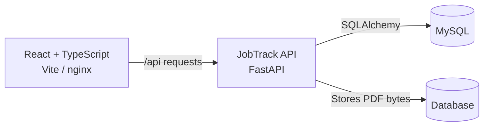

# JobTrack

> Keep your job search organized with application tracking, status history,
> reminders, resume storage, and dashboard statistics.

JobTrack is a full-stack job application tracker built with React, TypeScript,
FastAPI, and MySQL. It helps keep applications and follow-ups in one place.
Resumes can be stored securely with your account; JobTrack does not score them.

## Learn the project

New to the codebase? Read the [beginner-friendly project guide](docs/JobTrack-Beginner-Guide.pdf)
for a plain-language walkthrough of the features, architecture, source files,
and local setup.

## Features

- Track companies, roles, job links, job descriptions, notes, and application
  statuses.
- Review a chronological history of status changes.
- Create reminders and see which follow-ups are due.
- Upload and manage up to five PDF resumes per account.
- View dashboard statistics for application activity and response rates.
- Keep application and resume data scoped to the authenticated account.

## Technology stack

| Area | Technology |
| --- | --- |
| Frontend | React 18, TypeScript, Vite |
| Data and forms | TanStack Query, React Hook Form, Zod |
| Backend | Python 3.11+, FastAPI, SQLAlchemy |
| Database | MySQL 8.4; SQLite supported for tests and local development |
| Authentication | JWT bearer tokens and bcrypt password hashing |
| Local orchestration | Docker Compose |

## Architecture



The frontend sends requests to the JobTrack API under `/api`. In Docker Compose,
nginx forwards those requests to the API container. The API authenticates and
authorizes requests, then stores application and resume data in the database.
PDF bytes are stored in the database rather than written to the API server's
filesystem. JobTrack does not include a separate resume-scoring service or
scoring API.

## Repository structure

```text
.
├── .env.example                         # Example local backend/database settings
├── .gitignore                            # Ignores secrets, caches, and build output
├── .vscode/settings.json                 # Workspace editor settings
├── docker-compose.yml                    # MySQL, API, and frontend services
├── README.md                             # Project overview and setup guide
├── docs/
│   └── JobTrack-Beginner-Guide.pdf        # Beginner's guide to the complete project
├── backend/
│   ├── Dockerfile                        # Backend container image
│   ├── requirements.txt                  # Python dependencies
│   ├── app/
│   │   ├── config.py                     # Environment loading and validation
│   │   ├── db.py                         # SQLAlchemy engine and DB sessions
│   │   ├── main.py                       # FastAPI app, routers, health check
│   │   ├── models.py                     # Database entities and relationships
│   │   ├── schemas.py                    # API request and response models
│   │   ├── security.py                   # Password hashing and JWT auth
│   │   ├── routers/
│   │   │   ├── __init__.py               # Router package marker
│   │   │   ├── applications.py           # Applications and status history
│   │   │   ├── auth.py                   # Signup, login, and account endpoints
│   │   │   ├── reminders.py              # Reminder creation and completion
│   │   │   ├── resumes.py                # Resume upload and management
│   │   │   └── stats.py                  # Dashboard statistics endpoint
│   │   ├── services/
│   │   │   ├── __init__.py               # Service package marker
│   │   │   └── stats_service.py          # Dashboard statistics calculations
│   │   ├── scripts/
│   │   │   ├── __init__.py               # Script package marker
│   │   │   └── seed_demo_data.py         # Local demo data generator
│   │   └── tests/
│   │       ├── conftest.py               # Shared pytest configuration
│   │       ├── test_applications.py      # Application API tests
│   │       ├── test_auth.py              # Authentication tests
│   │       ├── test_health.py            # Health endpoint tests
│   │       ├── test_resumes.py           # Resume upload and management tests
│   │       ├── test_stats.py              # Statistics tests
│   │       └── test_status_reminders.py  # Status history and reminder tests
└── frontend/
    ├── .env.example                      # Example frontend environment settings
    ├── Dockerfile                        # Frontend build and nginx image
    ├── eslint.config.js                  # ESLint configuration
    ├── index.html                        # Vite HTML entry point
    ├── nginx.conf                        # Static hosting and API proxy
    ├── package.json                      # Frontend scripts and dependencies
    ├── package-lock.json                 # Locked npm dependencies
    ├── tsconfig.json                     # TypeScript configuration
    ├── vite.config.ts                    # Vite and test configuration
    └── src/
        ├── App.tsx                       # Routes and app-level providers
        ├── App.test.tsx                  # App-level tests
        ├── main.tsx                      # React entry point
        ├── styles.css                    # Global styles and layout
        ├── api/
        │   ├── client.ts                 # Typed API calls and auth handling
        │   ├── client.test.ts             # API client tests
        │   ├── format.ts                 # Shared display formatting helpers
        │   ├── format.test.ts             # Formatting tests
        │   └── generated.ts              # OpenAPI-generated API types
        ├── components/
        │   ├── ApplicationForm.tsx       # Create/edit application form
        │   ├── ErrorBoundary.tsx         # Rendering error fallback
        │   ├── Layout.tsx                # Authenticated app shell/navigation
        │   ├── PageState.tsx             # Loading, empty, and error states
        │   ├── ProtectedRoute.tsx        # Authenticated route guard
        │   ├── ProtectedRoute.test.tsx   # Route guard tests
        │   ├── Toast.tsx                 # Toast notification provider
        │   └── ToastContext.ts           # Toast notification context
        ├── pages/
        │   ├── ApplicationDetail.tsx     # Application details/history/reminders
        │   ├── Applications.tsx          # Application list and filters
        │   ├── AuthPage.tsx              # Signup and login forms
        │   ├── AuthPage.test.tsx         # Authentication page tests
        │   ├── Dashboard.tsx             # Statistics and charts
        │   ├── Resumes.tsx               # Resume upload and management
        │   └── Settings.tsx              # Account settings and deletion
        └── test/
            ├── server.ts                 # Mock Service Worker test server
            └── setup.ts                  # Shared frontend test setup
```

## Getting started

### Requirements

- Docker Desktop with Docker Compose, or Python 3.11+ and Node.js 20+ to run
  services individually.

### Run with Docker Compose

1. Copy `.env.example` to `.env` in the project root.
2. Set unique local MySQL passwords and replace `JWT_SECRET` with a random
   secret that is at least 32 bytes.
3. Build and start MySQL, the API, and the frontend:

   ```powershell
   docker compose up --build
   ```

4. Open the frontend at [http://localhost:3000](http://localhost:3000). The API
   health check is at [http://localhost:8000/health](http://localhost:8000/health)
   and interactive API docs are at [http://localhost:8000/docs](http://localhost:8000/docs).
5. Create an account from the signup page.

Stop the services with `Ctrl+C`, or run `docker compose down` in another
terminal. To also remove the local MySQL data volume, run
`docker compose down --volumes`.

### Run the frontend separately

Start the API and database first, then run from `frontend/`:

```powershell
npm ci
npm run dev
```

Vite serves the frontend at [http://localhost:5173](http://localhost:5173) and
proxies `/api` and `/health` to `http://127.0.0.1:8000`.

## Configuration

Copy `.env.example` to `.env` for local Compose use. The root environment file
configures MySQL and the API:

| Variable | Purpose |
| --- | --- |
| `MYSQL_DATABASE` | Database created by MySQL |
| `MYSQL_USER` | Application database user |
| `MYSQL_PASSWORD` | Application database password |
| `MYSQL_ROOT_PASSWORD` | Local MySQL root password |
| `DATABASE_URL` | SQLAlchemy connection string |
| `JWT_SECRET` | JWT signing secret; use at least 32 bytes |
| `ALLOWED_ORIGINS` | Comma-separated exact origins for cross-origin browser use |

The Compose frontend is built with `VITE_API_URL=/api` and served through
nginx. For a separately hosted frontend, see `frontend/.env.example`. The
frontend API URL is embedded at build time. When frontend and API origins
differ, add the exact frontend origin to `ALLOWED_ORIGINS`; wildcard origins
are rejected.

## API overview

API routes are served under `/api`, except `/health` and FastAPI's `/docs`.
Most endpoints require a bearer token from signup/login.

| Area | Main routes |
| --- | --- |
| Authentication | `POST /api/auth/signup`, `POST /api/auth/login`, `GET /api/auth/me` |
| Applications | `/api/applications` — create, list, update, and delete |
| Status history | `PATCH /api/applications/{id}/status`, `GET /api/applications/{id}/history` |
| Reminders | `/api/applications/{id}/reminders`, `GET /api/reminders`, `PATCH /api/reminders/{id}/done` |
| Resumes | `POST /api/resumes`, `GET /api/resumes`, `DELETE /api/resumes/{id}` |
| Dashboard | `GET /api/stats` |

Open `/docs` on the API server for the interactive OpenAPI interface. Generate
frontend API types with `npm run generate:api` while the API is running.

## Tests and quality checks

Run backend tests from `backend/`:

```powershell
python -m pip install -r requirements.txt
python -m pytest
```

Run frontend checks from `frontend/`:

```powershell
npm ci
npm run lint
npm run typecheck
npm test
npm run build
```

Generate six local demo applications from `backend/`:

```powershell
python -m scripts.seed_demo_data
```

For a larger dataset, use `python -m scripts.seed_demo_data --count 1000`.
Re-running the script replaces only the `demo@jobtrack.local` account and its
data. Its local demo password is `demo-password`; use this demo account only
with non-sensitive local data.

## Security and privacy

- Use unique, randomly generated `JWT_SECRET` and database passwords. Never
  commit `.env`.
- Uploaded PDFs must be no larger than 2 MB and are stored in the database.
- Application and resume access is scoped to the authenticated user. Deleting
  an application also deletes its status history and reminders.
- Use sample data for public deployments. Do not upload a real resume or enter
  private application details into a public instance.
